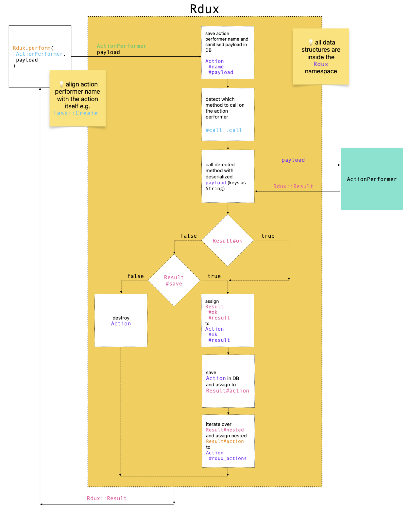

# Rdux - A Minimal Event Sourcing Plugin for Rails

<div align="center">

  <div>
    
  </div>


</div>

Rdux is a lightweight, minimalistic Rails plugin designed to introduce event sourcing and audit logging capabilities to your Rails application. With Rdux, you can efficiently track and store the history of actions performed within your app, offering transparency and traceability for key processes.

**Key Features**

* **Audit Logging** 👉 Rdux stores sanitized input data, the name of module or class (action performer) responsible for processing them, processing results, and additional metadata in the database.
* **Model Representation** 👉 Before action is executed it gets stored in the database through the `Rdux::Action` model. This model can be nested, allowing for complex action structures.
* **Exception Handling and Recovery** 👉 Rdux automatically creates a `Rdux::Action` record when an exception occurs during action execution. It retains the `payload` and allows you to capture additional data using `opts[:result]`, ensuring all necessary information is available for retrying the action.
* **Metadata** 👉 Metadata can include the ID of the authenticated resource responsible for performing a given action, as well as resource IDs from external systems related to the action. This creates a clear audit trail of who executed each action and on whose behalf.

Rdux is designed to integrate seamlessly with your existing Rails application, offering a straightforward and powerful solution for managing and auditing key actions.

## 📲 Instalation

Add this line to your application's Gemfile:

```ruby
gem 'rdux'
```

And then execute:

```bash
$ bundle
```

Or install it yourself as:

```bash
$ gem install rdux
```

Then install and run migrations:

```bash
$ bin/rails rdux:install:migrations
$ bin/rails db:migrate
```

⚠️ Note: Rdux uses `JSONB` datatype instead of `text` for Postgres.

## 🎮 Usage

### 🚛 Dispatching an action

To dispatch an action using Rdux, use the `dispatch` method (aliased as `perform`).

Definition:

```ruby
def dispatch(action, payload, opts = {}, meta: nil)

alias perform dispatch
```

Arguments:

* `action`: The name of the module or class (action performer) that processes the action. `action` is stored in the database as the `name` attribute of the `Rdux::Action` instance (e.g., `Task::Create`).
* `payload` (Hash): The input data passed as the first argument to the `call` method of the action performer. The data is sanitized and stored in the database before being processed by the action performer. During deserialization, the keys in the `payload` are converted to strings.
* `opts` (Hash): Optional parameters passed as the second argument to the `call` method, if defined. This can help avoid redundant database queries (e.g., if you already have an ActiveRecord object available before calling `Rdux.perform`). A helper is available to facilitate this use case: `(opts[:ars] || {}).each { |k, v| payload["#{k}_id"] = v.id }`, where `:ars` represents ActiveRecord objects. Note that `opts` is not stored in the database, and the `payload` should be fully sufficient to perform an **action**. `opts` provides an optimization.
* `meta` (Hash): Additional metadata stored in the database alongside the `action` and `payload`.

Example:

```ruby
Rdux.perform(
  Task::Create,
  { task: { name: 'Foo bar baz' } },
  { ars: { user: current_user } },
  meta: { bar: 'baz' }
)
```

### 📈 Flow diagram



### 🕵️‍♀️ Processing an action

Action in Rdux is processed by an action performer which is a Plain Old Ruby Object (PORO) that implements a class or instance method `call`.
This method accepts a required `payload` and an optional `opts` argument.
`call` method processes the action and must return a `Rdux::Result` struct.

See [🚛 Dispatching an action](#-dispatching-an-action) section.

Example:

```ruby
# app/actions/task/create.rb

class Task
  class Create
    def call(payload, opts)
      user = opts.dig(:ars, :user) || User.find(payload['user_id'])
      task = user.tasks.new(payload['task'])
      if task.save
        Rdux::Result[ok: true, val: { task: }]
      else
        Rdux::Result[false, { errors: task.errors }]
      end
    end
  end
end
```

#### Suggested Directory Structure:

The location that is often used for entities like actions accross code bases is `app/services`.
This directory is de facto the bag of random objects.
I'd recomment to place actions inside `app/actions` for better organization and consistency.
Actions are consistent in terms of structure, input and output data.
They are good canditates to create a new layer in Rails apps.

Structure:

```
.
└── app/actions/
    ├── activity/
    │   ├── common/
    │   │   └── fetch.rb
    │   ├── create.rb
    │   ├── stop.rb
    │   └── switch.rb
    ├── task/
    │   ├── create.rb
    │   └── delete.rb
    └── misc/
        └── create_attachment.rb
```

The [dedicated page about actions](docs/ACTIONS.md) contains more arguments in favor of actions.

### ⛩️ Returned `struct` `Rdux::Result`

Definition:

```ruby
module Rdux
  Result = Struct.new(:ok, :val, :result, :save, :nested, :action) do
    def save_failed?
      ok == false && save ? true : false
    end
  end
end
```

Arguments:

* `ok` (Boolean): Indicates whether the action was successful. If `true`, the `Rdux::Action` is persisted in the database.
* `val` (Hash): returned data.
* `result` (Hash): Stores data related to the action’s execution, such as created record IDs, DB changes, responses from 3rd parties, etc. that will be persisted as `Rdux::Action#result`.
* `save` (Boolean): If `true` and `ok` is `false`, the action is still persisted in the database.
* `nested` (Array of `Rdux::Result`): `Rdux::Action` can be connected with other `rdux_actions`. To establish an association, a given action must `Rdux.dispatch` other actions in the `call` method and add the returned by the `dispatch` value (`Rdux::Result`) to the `:nested` array
* `action`: Rdux assigns persisted `Rdux::Action` to this argument

### 🗿 Data model

```ruby
payload = {
  task: { 'name' => 'Foo bar baz' },
  user_id: 159163583
}

res = Rdux.dispatch(Task::Create, payload)

res.action
# #<Rdux::Action:0x000000011c4d8e98
#   id: 1,
#   name: "Task::Create",
#   payload: {"task"=>{"name"=>"Foo bar baz"}, "user_id"=>159163583},
#   payload_sanitized: false,
#   result: nil,
#   meta: {},
#   rdux_action_id: nil,
#   created_at: Fri, 28 Jun 2024 21:35:36.838898000 UTC +00:00,
#   updated_at: Fri, 28 Jun 2024 21:35:36.839728000 UTC +00:00>>
```

### 😷 Sanitization

When `Rdux.perform` is called, the `payload` is sanitized using `Rails.application.config.filter_parameters` before being saved to the database.
The action performer’s `call` method receives the unsanitized version.

### 🗣️ Queries

Most likely, it won't be necessary to save a `Rdux::Action` for every request a Rails app receives.
The suggested approach is to save `Rdux::Action`s for Create, Update, and Delete (CUD) operations.
This approach organically creates a new layer - queries in addition to actions.
Thus, it is required to call `Rdux.perform` only for actions.

One approach is to create a `perform` method that invokes either `Rdux.perform` or a query, depending on the presence of `action` or `query` keywords.
This method can also handle setting `meta` attributes, performing parameter validation, and more.

Example:

```ruby
class TasksController < ApiController
  def show
    perform(
      query: Task::Show,
      payload: { id: params[:id] }
    )
  end

  def create
    perform(
      action: Task::Create,
      payload: create_task_params
    )
  end
end
```

### 🕵️ Indexing

Depending on your use case, it’s recommended to create indices, especially when using PostgreSQL and querying JSONB columns.
Both `Rdux::Action` and `Rdux::FailedAction` are standard ActiveRecord models.
You can inherit from them and extend.

Example:
```ruby
class Action < Rdux::Action
  include Actionable
end
```

### 🚑 Recovering from Exceptions

Rdux creates a `Rdux::FailedAction` when an exception is raised during the execution of an action.
The `up_payload` is retained, but having only the input data is often not enough to retry an action.
It is crucial to capture data obtained during the action’s execution, up until the exception occurred.
This can be done by using `opts[:up_result]` to store all necessary data incrementally.
The assigned data will then be available as the `up_result` argument in the `Rdux::FailedAction`.

Example:
```ruby
class CreditCard
  class Charge
    class << self
      def call(payload, opts)
        create_res = create(payload.slice('user_id', 'credit_card'), opts.slice(:user))
        return create_res unless create_res.ok

        opts[:up_result] = { credit_card_create_action_id: create_res.action.id }
        charge_id = PaymentGateway.charge(create_res.val[:credit_card].token, payload['amount'])[:id]
        if charge_id.nil?
          Rdux::Result[ok: false, val: { errors: { base: 'Invalid credit card' } }, save: true,
                       nested: [create_res]]
        else
          Rdux::Result[ok: true, val: { charge_id: }, nested: [create_res]]
        end
      end

      private

      def create(payload, opts)
        res = Rdux.perform(Create, payload, opts)
        return res if res.ok

        Rdux::Result[ok: false, val: { errors: res.val[:errors] }, save: true, nested: [res]]
      end
    end
  end
end
```

## 👩🏽‍🔬 Testing

### 💉 Setup

```bash
$ cd test/dummy
$ DB=all bin/rails db:create
$ DB=all bin/rails db:prepare
$ cd ../..
```

### 🧪 Run tests

```bash
$ DB=postgres bin/rails test
$ DB=sqlite bin/rails test
```

## 📄 License

The gem is available as open source under the terms of the [MIT License](https://opensource.org/licenses/MIT).

## 👨‍🏭 Author

Zbigniew Humeniuk from [Art of Code](https://artofcode.co)
